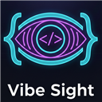

# Vibe Sight

Give your AI coder eyes. A visual DOM inspector that lets you click, comment, and snipe UI elements straight into copy-pasteable prompts for vibe coding.



---

## Features

- **Visual Element Inspector** — Hover to highlight, click to lock. Works like DevTools element picker.
- **Inline Comment Cards** — Attach instructions to any selected element. One card visible at a time.
- **Smart Unique Selectors** — Progressive algorithm generates minimal CSS selectors verified to match exactly one element.
- **Token-Optimized Prompts** — Cleaned HTML (150 chars), filtered styles (defaults removed), dense inline format.
- **Customizable Templates** — System prompt prefix, per-element format with placeholders, and preset configs (Tailwind, React, Vue).
- **Customizable Hotkey** — Record your own keyboard shortcut. Changes apply instantly without reload.
- **Shadow DOM Isolation** — All injected UI lives inside a shadow root. Zero CSS/JS bleed into the host page.

---

## Installation

### Prerequisites

- Microsoft Edge (Chromium-based) or Google Chrome
- No build tools required — this is vanilla JS

### Install from Source (Developer Mode)

1. **Clone the repository**
   ```bash
   git clone https://github.com/arijitsumit/Vibe-Sight.git
   cd Vibe-Sight
   ```

2. **Open the Extensions page**
   - In Edge: navigate to `edge://extensions/`
   - In Chrome: navigate to `chrome://extensions/`

3. **Enable Developer Mode**
   - Toggle the switch in the top-left corner

4. **Load the extension**
   - Click **"Load unpacked"**
   - Select the `Vibe-Sight/` folder (the one containing `manifest.json`)

5. **Pin it**
   - Click the puzzle piece icon in your toolbar
   - Find Vibe Sight and click the pin icon

That's it. No build step, no npm install, no dependencies.

---

## Usage

### Basic Workflow

1. **Activate** — Press `Ctrl + \` (or your custom hotkey) on any webpage. The cursor changes to a crosshair.

2. **Select elements** — Hover to preview (dashed indigo outline), click to lock (solid green outline). A comment card appears below the element.

3. **Add instructions** — Type your instruction in the comment card (e.g., "make this button purple", "remove this section on mobile").

4. **Select more elements** — Click other elements to add more annotations. Previous highlights stay visible. Only one comment card is open at a time — click a highlight label to re-open its comment.

5. **Generate prompt** — Click the floating "✨ Generate Prompt" button (bottom-right) or use the popup. The formatted prompt is copied to your clipboard automatically.

6. **Paste into your AI** — Switch to Cursor, Claude, Devin, Copilot, etc. and paste.

### Popup Controls

Click the Vibe Sight icon in your toolbar to open the popup:

| Button | Action |
|--------|--------|
| **Activate / Deactivate** | Toggle selection mode |
| **Generate & Copy Prompt** | Build and copy the prompt |
| **Clear All** | Remove all annotations from the page |

### Customizing the Prompt Format

1. Open the popup and expand **"Prompt Settings"**
2. Choose a preset or write your own:

**System Prompt** — Prepended to every generated output. Examples:
```
Act as a Tailwind CSS expert. Output only the modified HTML with updated classes.
```
```
Act as a React developer. Output only JSX changes. Preserve props and state.
```

**Element Format** — Customize how each element block looks using placeholders:
- `{n}` — Element number (1, 2, 3...)
- `{selector}` — Smart unique CSS selector
- `{html}` — Cleaned HTML (150 chars)
- `{styles}` — High-signal computed styles
- `{instruction}` — Your comment

Default format:
```
[EL{n}] {selector}
HTML: {html}
Styles: {styles}
Instruction: {instruction}
```

### Changing the Keyboard Shortcut

1. Open the popup and expand **"Prompt Settings"**
2. Click the **shortcut input** field
3. Press your new combo (must include Ctrl, Alt, or Shift)
4. It saves instantly — no page reload needed
5. Press **Escape** to cancel, or click **Reset** to restore `Ctrl + \`

---

## Example Output

With the default settings, annotating two elements produces:

```
URL: https://example.com/
---

[EL1] div.hero > h1.text-bold
HTML: <h1 class="text-bold">Welcome to Our Platform</h1>
Styles: font-size:48px; font-weight:700; color:rgb(17, 24, 39)
Instruction: make this heading a bit smaller

[EL2] div.content > p.lead
HTML: <p class="lead">Build something amazing today.</p>
Styles: font-size:18px; color:rgb(75, 85, 99)
Instruction: change the text color to blue
```

With the Tailwind preset:

```
Act as a Tailwind CSS expert. Output only the modified HTML with updated Tailwind classes. No explanations needed.

URL: https://example.com/
---

[EL1] div.hero > h1.text-bold
HTML: <h1 class="text-bold">Welcome to Our Platform</h1>
Styles: font-size:48px; font-weight:700; color:rgb(17, 24, 39)
Instruction: make this heading a bit smaller
```

---

## Architecture

```
vibe-sight/
├── manifest.json        # Manifest V3 config
├── background.js        # Service worker — badge state
├── content.js           # Core — DOM inspector, annotations, prompt engine
├── popup.html           # Extension popup UI
├── popup.js             # Popup logic — settings, controls
├── icons/
│   ├── icon16.png
│   ├── icon48.png
│   └── icon128.png
└── README.md
```

### Key Design Decisions

| Decision | Why |
|----------|-----|
| **Shadow DOM (open mode)** for all injected UI | Prevents CSS bleed from host pages. Open mode allows event delegation from within the shadow. |
| **`position: absolute`** on host container | Anchors to document space so highlights scroll naturally with the page. No scroll-offset math needed. |
| **`pointer-events: none`** on host, `auto` on interactive children | Overlay is click-through except for comment cards and FAB buttons. |
| **Event capture phase** (`true`) for click/mousemove | Intercepts clicks before the page handles them — prevents navigation while selecting. |
| **Progressive selector algorithm** | Starts minimal (tag.class), escalates only as needed (parent ID anchor → nth-of-type), verified via `querySelectorAll`. |
| **`chrome.storage.local`** for settings | Shared between popup and content script. Content script listens to `onChanged` for live updates. |

### Content Script Architecture

The content script is organized into isolated sections:

1. **State** — `isActive`, `annotations` Map, `activeAnnotationId`, `currentHotkey`
2. **Shadow Host** — Creates/destroys the isolated DOM container
3. **Selector Generation** — Smart unique selector with utility-class filtering
4. **Overlay** — Hover highlight (dashed indigo)
5. **Highlights** — Locked selection markers (solid green)
6. **Comment Cards** — Inline text inputs with visibility state management
7. **FAB** — Floating action button for prompt generation
8. **Prompt Engine** — `cleanHtml`, `extractHighSignalStyles`, `buildPrompt` with template system
9. **Event Handling** — Document capture + shadow delegation

---

## Token Optimization Strategies

| Strategy | Before | After |
|----------|--------|-------|
| Selectors | Deep DOM paths with nth-of-type chains | tag.class, ID-anchored, max 1 parent level |
| HTML | Full outerHTML (800 chars) | Stripped noise, 150-char truncation |
| Styles | 14 computed styles including defaults | Filtered to max 5, zero/default values removed |
| Format | Markdown headers, code fences, bold labels | Dense inline `Key: Value` format |
| System prompt | None | Optional prefix, saved per session |

---

## Browser Compatibility

| Browser | Status |
|---------|--------|
| Microsoft Edge (Chromium) | Fully supported |
| Google Chrome | Fully supported |
| Brave | Should work (Chromium-based) |
| Firefox | Not tested — would require manifest adjustments |
| Safari | Not supported |

---

## Development

### Project Structure Principles

- **Vanilla JS only** — No React, Angular, or build tools
- **ES6+ IIFE** — Content script wrapped in `(() => { ... })()` for isolation
- **Functional style** — Pure functions, immutable data, no classes
- **Shadow DOM** — All styles scoped, no global CSS leakage
- **CSP compliant** — No inline scripts in HTML, all JS in separate files

### Making Changes

1. Edit the relevant file
2. Go to `edge://extensions/` (or `chrome://extensions/`)
3. Click the **refresh icon** on the Vibe Sight card
4. Reload the page you're testing on

### Regenerating Icons

Run the PowerShell script in `icons/`:

```powershell
powershell -ExecutionPolicy Bypass -File icons/gen.ps1
```

---

## Contributing

1. Fork the repository
2. Create your feature branch: `git checkout -b feature/my-feature`
3. Commit your changes: `git commit -m "Add my feature"`
4. Push to the branch: `git push origin feature/my-feature`
5. Open a Pull Request

### Guidelines

- Keep it vanilla JS — no frameworks or build tools
- All injected UI must use Shadow DOM
- Functions should be < 50 lines
- Test on both Edge and Chrome before submitting

---

## License

This project is licensed under the MIT License. See the [LICENSE](LICENSE) file for details.
